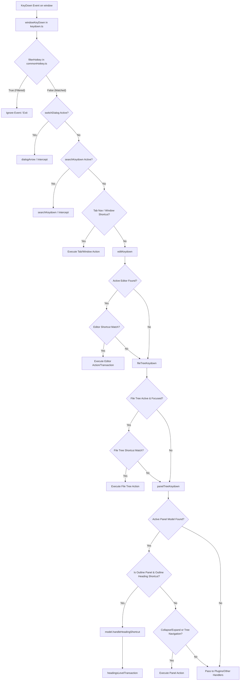

# Keymap System Architecture

This document describes the design, implementation, and flow of the keymap and keyboard shortcut system in SiYuan.

---

## Summary

SiYuan's keyboard shortcut system is centralized around a single global listener on the browser `window` object. Keyboard events are captured, filtered for compose-states and non-hotkey keys, and then dispatched sequentially down through the active components (Editor, File Tree, Dock Panels, Plugins) until a match is found and consumed. 

---

## Key Files

* **Default Keymaps & Mapping Constants**: 
  * [`app/src/constants.ts`](file:///f:/SiYuan/siyuan/app/src/constants.ts#L431-L611) — Defines `Constants.SIYUAN_KEYMAP` (the default keymap structure) and `Constants.KEYCODELIST` (key code symbol mappings).
* **Shortcut Matching**:
  * [`app/src/protyle/util/hotKey.ts`](file:///f:/SiYuan/siyuan/app/src/protyle/util/hotKey.ts) — Implements `matchHotKey` and `matchAuxiliaryHotKey` functions for comparing event descriptors against hotkey strings.
* **Compatibility Layer**:
  * [`app/src/protyle/util/compatibility.ts`](file:///f:/SiYuan/siyuan/app/src/protyle/util/compatibility.ts) — Implements OS platform queries (`isMac()`, `isWindows()`) and auxiliary key checks (`isOnlyMeta()`, `isNotCtrl()`).
* **Global Event Hooks & Verification**:
  * [`app/src/boot/globalEvent/event.ts`](file:///f:/SiYuan/siyuan/app/src/boot/globalEvent/event.ts) — Registers the global `keydown` event listener on `window`.
  * [`app/src/boot/globalEvent/keydown.ts`](file:///f:/SiYuan/siyuan/app/src/boot/globalEvent/keydown.ts) — Processes keydown events and routes them to context-specific hotkey handlers (`editKeydown`, `fileTreeKeydown`, `panelTreeKeydown`).
  * [`app/src/boot/globalEvent/commonHotkey.ts`](file:///f:/SiYuan/siyuan/app/src/boot/globalEvent/commonHotkey.ts) — Validates the user's config against defaults, normalizes hotkeys per OS platform (via `correctHotkey`), and saves changes to the backend.
* **Outline Panels**:
  * [`app/src/layout/dock/Outline.ts`](file:///f:/SiYuan/siyuan/app/src/layout/dock/Outline.ts) — Implements the Outline panel model, intercepting heading transformation and navigation keys via `handleHeadingShortcut`.
* **Transaction Engine**:
  * [`app/src/protyle/wysiwyg/transaction.ts`](file:///f:/SiYuan/siyuan/app/src/protyle/wysiwyg/transaction.ts) — Processes edits, undo/redo logs, updates the editor DOM immediately, and queues/batches API transactions back to the server (via `transaction` and `headingsLevelTransaction`).

---

## Keymap Data Model

The active keymap configurations are stored in the global configuration object under `window.siyuan.config.keymap`, conforming to the `Config.IKeymap` TypeScript interface. The structure consists of three main segments:

1. **`general`**: Application-level shortcuts (e.g. navigation, panel toggling, tab controls).
   * Example: `window.siyuan.config.keymap.general.globalSearch`
2. **`editor`**: Editor-specific shortcuts grouped into logical blocks:
   * **`general`**: Operations like copy, duplicate, undo, redo, and fold controls.
   * **`insert`**: Formatting operations like bold, italic, links, and lists.
   * **`heading`**: Heading level transformations (`heading1` to `heading6`, upgrade, downgrade).
   * **`list`**: Indentation and task list toggles.
   * **`table`**: Table row/column manipulation.
3. **`plugin`**: Keymaps registered dynamically by custom plugins.

Each individual key mapping consists of a configuration object:
```typescript
interface IKeymapItem {
    default: string; // The original hardcoded fallback key combination
    custom: string;  // The user-configured key combination (can be edited/blanked)
}
```

---

## Shortcut Matching

### `matchHotKey`

Shortcut matching is implemented in `matchHotKey(hotKey: string, event: KeyboardEvent): boolean` in [`hotKey.ts`](file:///f:/SiYuan/siyuan/app/src/protyle/util/hotKey.ts#L55).

### Event Fields Used
* `event.keyCode`: Matched against `Constants.KEYCODELIST` to convert the number keycode to its string representation (e.g., `8` -> `⌫`, `13` -> `↩`, `16` -> `⇧`, `17` -> `⌃`, `18` -> `⌥`, `91`/`92` -> `⌘`).
* `event.ctrlKey`, `event.altKey`, `event.shiftKey`, `event.metaKey`: Boolean values representing modifier states.

### Representation of Modifiers
Modifiers are represented as prefix symbols inside the hotkey string:
* `⌃` represents `Ctrl` / Control
* `⌥` represents `Alt` / Option
* `⇧` represents `Shift`
* `⌘` represents `Cmd` / Command (on macOS) or `Ctrl` (on Windows/Linux)

### Normalization and Platform Compatibility
1. **OS Translation**: If running on Windows/Linux, `matchHotKey` translates shortcuts starting with macOS `⌃` to `⌘` (except for `⌃D`) and aligns key syntax to ensure matching compatibility.
2. **Platform Flags**:
   * `isMac()`: Detects platform by checking if `navigator.platform` contains `"MAC"`.
   * `isOnlyMeta(event)`: Ensures only the system-level command modifier is pressed. On macOS, this returns true if `event.metaKey && !event.ctrlKey`. On Windows/Linux, this returns true if `!event.metaKey && event.ctrlKey`.
   * `isNotCtrl(event)`: Returns true if neither `metaKey` nor `ctrlKey` is pressed.
3. **Matching Evaluation**:
   * If the hotkey configuration is empty or falsy, matching immediately returns `false`.
   * If no modifier symbols (`⇧`, `⌘`, `⌥`, `⌃`) are present in the target hotkey string, it checks that no modifiers are active on the event and compares the key code against `Constants.KEYCODELIST[event.keyCode]`.
   * If modifiers are present, it evaluates whether the specific modifier combinations (like `⌥⇧⌘`, `⌥⇧`, `⌃⇧`) are present and matches their corresponding Boolean states on `event`.

---

## Keydown Dispatch Flow

All keydown events trigger `windowKeyDown(app, event)` via the window listener. The overall control flow goes through a sequence of checks:



### 1. Filtering
The event first passes through `filterHotkey(event, app)` in [`commonHotkey.ts`](file:///f:/SiYuan/siyuan/app/src/boot/globalEvent/commonHotkey.ts#L139). This blocks standard typing (e.g. single alphanumeric keys) unless a modifier key (like Ctrl, Cmd, Alt) is held, or if the user is composing text (`event.isComposing`).

### 2. Dialog / Tab Traversal
If a switch tab dialog is open (`switchDialog`), it intercepts arrow/enter keys to cycle through tabs. If search panel events are active, `searchKeydown` intercepts.

### 3. Editor Shortcut Path
If not intercepted by tab/dialog overlays, the event goes to `editKeydown(app, event)` in [`keydown.ts`](file:///f:/SiYuan/siyuan/app/src/boot/globalEvent/keydown.ts#L178):
1. Looks for the active editor instance (`protyle`) on the page (active editor tab, active editor popover, active backlink model editors, etc.).
2. If found, it checks editor-specific shortcuts (e.g., duplicate, copy block ref, undo, redo, format bold/italic/links) using `matchHotKey`.
3. If a match is found, the action is executed (preventing default event behavior) and returns `true`, halting the dispatch.

### 4. File Tree Shortcut Path
If `editKeydown` returns false, control passes to `fileTreeKeydown(app, event)` in [`keydown.ts`](file:///f:/SiYuan/siyuan/app/src/boot/globalEvent/keydown.ts#L553):
1. Verifies if the file tree panel (`Files` model) is active and focused.
2. Intercepts shortcuts such as rename (`F2`), space repetition, quick make flashcard, and file tree node navigation (up/down/left/right/enter/delete).

### 5. Panel / Dock Shortcut Path
If still unconsumed, control passes to `panelTreeKeydown(app, event)` in [`keydown.ts`](file:///f:/SiYuan/siyuan/app/src/boot/globalEvent/keydown.ts#L971):
1. Finds the active dock panel (bookmark, tags, outline, backlinks).
2. Checks for general collapse/expand icons and routes click events directly to them.
3. If the panel is the Outline panel (`sy__outline`), it detects if the shortcut is an **Outline Heading Shortcut** (see section below). If it is, it dispatches directly to the Outline model.
4. Otherwise, it delegates key down navigation (arrow keys, enter) to the panel's active list tree (`tree`).

---

## Editor Action and Transaction Execution

When an editor shortcut matches in `editKeydown` (e.g. `undo` / `redo` / formatting / transformations), it executes as follows:

1. **Local State Update**: Calls the editor engine API on the active `protyle` instance (e.g., `protyle.undo.undo(protyle)`, `duplicateBlock()`, or `onlyProtyleCommand`).
2. **DOM Update**: The engine modifies the document's editor DOM elements directly (updating `outerHTML` or calling lute parser functions) for instant, snappy user feedback.
3. **Transaction Commit**: Emits the update through the transaction system in [`transaction.ts`](file:///f:/SiYuan/siyuan/app/src/protyle/wysiwyg/transaction.ts#L1454) by calling `transaction(protyle, doOperations, undoOperations)`.
   * It logs operations to `window.siyuan.transactions`.
   * Queues/batches transactions and posts them to the server `/api/transactions` endpoint using a debounced timer (`promiseTransaction()`).
4. **Rendering Refreshes**: Re-runs helper renderers for the updated blocks (e.g. `blockRender`, `avRender`, `highlightRender`).

---

## Non-Editor Panels: Reuse and Bypass

* **Keymap Reuse**: Non-editor panels reuse existing editor settings (like `window.siyuan.config.keymap.editor.general.collapse/expand`) for common UI actions (collapsing tree nodes) rather than defining separate configurations.
* **Engine Bypass**: Because these panels do not have a fully loaded WYSIWYG editor context, the keydown dispatcher bypasses the heavy editor engine pipeline (`editKeydown` and `fileTreeKeydown` return `false`). The dispatcher executes localized logic (like `tree.click(activeItemElement)` or custom selection checks) inside `panelTreeKeydown`, avoiding editor command-matching code.

---

## Outline Heading Shortcut Path

The Outline panel features a special execution path allowing users to change headings level in the WYSIWYG editor directly from the Outline tree view.

### Keymap Config Reuse
Outline reuses the editor heading configuration (`window.siyuan.config.keymap.editor.heading`), matching against settings for `heading1`-`heading6`, `headingUpgrade`, and `headingDowngrade`.

### Event Dispatch Path
1. The global window keydown listener receives a key combination and calls `panelTreeKeydown`.
2. `panelTreeKeydown` checks if the active tab is `sy__outline` and checks if the key matches `isOutlineHeadingShortcut`:
   ```typescript
   const headingConfig = window.siyuan.config.keymap.editor.heading;
   const isOutlineHeadingShortcut = activePanelElement.classList.contains("sy__outline") &&
       !event.repeat && !window.siyuan.config.readonly &&
       ((event.ctrlKey && event.altKey && /^[1-6]$/.test(event.key)) ||
           (event.altKey && !event.ctrlKey && !event.metaKey && ["+", "=", "-"].includes(event.key)) ||
           [1, 2, 3, 4, 5, 6].some(level => headingConfig[`heading${level}` as keyof typeof headingConfig]?.custom &&
               matchHotKey(headingConfig[`heading${level}` as keyof typeof headingConfig].custom, event)) ||
           (headingConfig.headingUpgrade?.custom && matchHotKey(headingConfig.headingUpgrade.custom, event)) ||
           (headingConfig.headingDowngrade?.custom && matchHotKey(headingConfig.headingDowngrade.custom, event)));
   ```
3. If `isOutlineHeadingShortcut` is true, the dispatcher fetches the active panel model, verifies it is an instance of `Outline`, and calls `model.handleHeadingShortcut(event)` in [`Outline.ts`](file:///f:/SiYuan/siyuan/app/src/layout/dock/Outline.ts#L1523).

### Shortcut Matching in Outline
Inside `handleHeadingShortcut(event)`:
* It loops from `level = 1` to `6`, verifying whether the key combination matches the configured `heading1` to `heading6` hotkeys via `matchHotKey(headingConfig[key].custom, event)` or falls back to `Ctrl+Alt+1-6`.
* It verifies whether upgrade/downgrade matches its custom configuration or falls back to `Alt+["+", "=", "-"]`.

### Transformation Logic Execution
1. Once matched, it calls `this.batchSetHeadingLevel(level)` or `this.batchChangeHeadingLevel(direction, selectedItems[0])`.
2. Locates the editor instance `protyle` linked to this outline using `this.getProtyle()`.
3. Gathers the DOM elements of the selected outline headings that need to be transformed.
4. Invokes `headingsLevelTransaction({ protyle, headingElements, level/direction })` from [`transaction.ts`](file:///f:/SiYuan/siyuan/app/src/protyle/wysiwyg/transaction.ts#L1102).
5. `headingsLevelTransaction` loops through target headings:
   * Uses lute compiler (`lute.Blocks2Hs(oldHTML, targetLevel)`) to parse and transform the block HTML to the new heading level.
   * If the block is folded, it manages folding transaction operations.
   * Modifies the editor's live HTML DOM (`item.outerHTML = newHTML`).
   * Registers the operation as a standard `update` action in the Protyle transaction engine (`transaction(protyle, doOperations, undoOperations)`), pushing the edits to the backend server.
   * Refreshes markdown and mathematical rendering in the viewport.

---

## Notes / Risks

* **Mac Command vs Control Key Translation**: On Windows/Linux, `matchHotKey` converts shortcuts starting with macOS `⌃` to `⌘` (which maps internally to Ctrl on non-Mac platforms). This means that Windows/Linux users may experience key conflicts if custom shortcuts overlap with system/browser shortcuts that rely on the Control key.
* **Read-only Environment Checks**: Shortcut handlers frequently verify `window.siyuan.config.readonly` before proceeding. When SiYuan is running in read-only mode, key down shortcuts that modify documents are early-exited or ignored.
* **Outline Synchronization**: The Outline heading transformations require a live, synchronized editor instance (`this.getProtyle()`). If the editor tab is closed or focus is lost, shortcut transformations will fail to apply.
