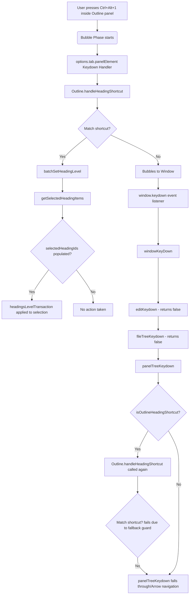

# Outline Heading Shortcuts Investigation Report

This report details the findings from our investigation into why Outline heading shortcuts, specifically `Ctrl+Alt+1..6`, do not work reliably in the Outline panel.

## Current Observed Behavior
- Pressing `Ctrl+Alt+1..6` while focused in the Outline panel (e.g. after focusing it via `Alt+O` or navigating list items using keyboard Arrow keys) does not change the level of the selected/focused heading.
- If an item was previously clicked (which sets the selection), pressing the shortcut might transform the previously clicked heading instead of the currently focused heading.
- Multi-selection level changes do not work reliably with keyboard shortcuts.

## Expected Behavior
- Pressing `Ctrl+Alt+1..6` while focused in the Outline panel should transform the level of the currently focused item (single selection) or all currently selected items (multi-selection).
- Keyboard navigation (Arrow keys) should update the focused/selected state of the Outline items so that shortcuts operate on the currently active/focused item.

## Event Flow and Ordered Call Chain

The diagram below details the keyboard event propagation and handling path when `Ctrl+Alt+1..6` is pressed inside the Outline panel:



---

## Editor Shortcut Path vs. Outline Shortcut Path

### Editor Shortcut Path
1. Editor shortcuts are registered directly on `protyle.wysiwyg.element` in [keydown.ts](file:///F:/SiYuan/siyuan/app/src/protyle/wysiwyg/keydown.ts#L95).
2. Mappings are checked using `matchHotKey(window.siyuan.config.keymap.editor.heading.headingX.custom, event)` in [keydown.ts](file:///F:/SiYuan/siyuan/app/src/protyle/wysiwyg/keydown.ts#L1425).
3. Level transformation is applied via `turnsIntoTransaction` with type `"Blocks2Hs"` and target `level`.

### Outline Shortcut Path
1. Keydown events bubble up to `options.tab.panelElement` where a local keydown handler delegates to `Outline.handleHeadingShortcut(event)` in [Outline.ts](file:///F:/SiYuan/siyuan/app/src/layout/dock/Outline.ts#L266).
2. If it is not matched, it bubbles to `window` and is caught by `windowKeyDown` which delegates to `panelTreeKeydown` in [keydown.ts](file:///F:/SiYuan/siyuan/app/src/boot/globalEvent/keydown.ts#L971).
3. If `isOutlineHeadingShortcut` is `true`, it delegates to `model.handleHeadingShortcut(event)`.
4. Level transformation is applied via `batchSetHeadingLevel(level)` calling `headingsLevelTransaction` in [transaction.ts](file:///F:/SiYuan/siyuan/app/src/protyle/wysiwyg/transaction.ts#L1102).

---

## Exact Blocker(s)

We identified two major root causes/blockers:

### 1. Selection Out-of-Sync During Keyboard Navigation
- **Location**: [keydown.ts](file:///F:/SiYuan/siyuan/app/src/boot/globalEvent/keydown.ts#L1103) (`panelTreeKeydown`) and [Outline.ts](file:///F:/SiYuan/siyuan/app/src/layout/dock/Outline.ts#L900) (`getSelectedHeadingItems`).
- **Explanation**: Keyboard navigation (Arrow Up/Down/Left/Right) in `panelTreeKeydown` directly updates the DOM class name `.b3-list-item--focus` on the active panel element but does **not** update `this.selectedHeadingIds` or `this.lastSelectedElement` inside the `Outline` model.
- **Consequence**: When `handleHeadingShortcut` is triggered, it calls `this.batchSetHeadingLevel(level)`, which internally calls `getSelectedHeadingItems` with no fallback element. Because `this.selectedHeadingIds` remains empty (or stale) during Arrow key navigation, `getSelectedHeadingItems` returns an empty array, and the shortcut is ignored.

### 2. Inconsistent Shortcut Matching (Lack of Fallback)
- **Location**: [Outline.ts](file:///F:/SiYuan/siyuan/app/src/layout/dock/Outline.ts#L1523) (`handleHeadingShortcut`).
- **Explanation**: The shortcut checker in `handleHeadingShortcut` uses the following check:
  ```typescript
  if ((headingConfig?.[key]?.custom && matchHotKey(headingConfig[key].custom, event)) ||
      (!headingConfig?.[key]?.custom && event.ctrlKey && event.altKey && event.key === String(level))) {
  ```
  Since `custom` is defined by default (e.g. `"⌥⌘1"`), the second branch (`!headingConfig?.[key]?.custom`) is **never** evaluated. If `matchHotKey` fails for any reason (e.g., keyboard layout differences, browser discrepancies, or environment mocks where `event.keyCode` is absent), the fallback is ignored.
- **Contrast**: In `panelTreeKeydown`, `isOutlineHeadingShortcut` uses a lenient fallback check:
  ```typescript
  ((event.ctrlKey && event.altKey && /^[1-6]$/.test(event.key)) || ...)
  ```
  This creates a mismatch: `isOutlineHeadingShortcut` evaluates to `true` (routing the event to the Outline model), but the model's `handleHeadingShortcut` returns `false`, causing the shortcut to be dropped.

---

## Why Existing Tests Did Not Catch the Failure

1. **Assertion Limitations**: The tests in [Outline.shortcuts.spec.ts](file:///F:/SiYuan/siyuan/app/src/layout/dock/Outline.shortcuts.spec.ts) only assert file content strings (e.g. checking if the file defines `handleHeadingShortcut`). They do not assert any runtime or integration behavior.
2. **Mocking Limitations**: In [Outline.selection.spec.ts](file:///F:/SiYuan/siyuan/app/src/layout/dock/Outline.selection.spec.ts), the tests mock the click events (`clickHeading`), which explicitly populates `selectedHeadingIds` before executing `dispatchCtrlAltNumber`. Clicks in production shift focus to the editor (`openFileById` with `Constants.CB_GET_FOCUS`), which is mocked out in the tests.
3. **No Keyboard Navigation Test**: There are no tests verifying what happens when a user navigates the tree via keyboard Arrow events and then dispatches a shortcut. Such a test would have exposed that `selectedHeadingIds` is not updated during keyboard navigation.

---

## Proposed Implementation Plan (Minimal Changes)

### Step 1: Sync Selection State from DOM in `handleHeadingShortcut`
Sync the `selectedHeadingIds` set from DOM elements with the class `.b3-list-item--focus` at the beginning of `handleHeadingShortcut` in [Outline.ts](file:///F:/SiYuan/siyuan/app/src/layout/dock/Outline.ts):
```typescript
    public handleHeadingShortcut(event: KeyboardEvent) {
        if (window.siyuan.config.readonly || event.repeat) {
            return false;
        }

        // Sync selection state from DOM focus state
        const focusedElements = this.element.querySelectorAll(".b3-list-item--focus");
        this.selectedHeadingIds.clear();
        focusedElements.forEach(item => {
            const id = item.getAttribute("data-node-id");
            if (id) {
                this.selectedHeadingIds.add(id);
            }
        });

        // Also ensure multi-select class is in sync
        this.element.classList.toggle("sy__outline--multi-select", this.selectedHeadingIds.size > 1);
```

### Step 2: Remove blocked fallback guards in `handleHeadingShortcut`
Enable fallback matching checks on Windows/Linux in [Outline.ts](file:///F:/SiYuan/siyuan/app/src/layout/dock/Outline.ts) even when `custom` is defined:
```typescript
        const headingConfig = window.siyuan.config.keymap.editor.heading;
        for (let level = 1; level <= 6; level++) {
            const key = `heading${level}` as keyof typeof headingConfig;
            if ((headingConfig?.[key]?.custom && matchHotKey(headingConfig[key].custom, event)) ||
                (event.ctrlKey && event.altKey && event.key === String(level))) {
                this.batchSetHeadingLevel(level);
                event.preventDefault();
                event.stopPropagation();
                return true;
            }
        }
        if ((headingConfig?.headingUpgrade?.custom &&
                matchHotKey(window.siyuan.config.keymap.editor.heading.headingUpgrade.custom, event)) ||
            (event.altKey && !event.ctrlKey && !event.metaKey && ["+", "="].includes(event.key))) {
             ...
        }
        if ((headingConfig?.headingDowngrade?.custom &&
                matchHotKey(window.siyuan.config.keymap.editor.heading.headingDowngrade.custom, event)) ||
            (event.altKey && !event.ctrlKey && !event.metaKey && event.key === "-")) {
             ...
        }
```

---

## Minimal TDD Plan

Before implementing the fixes, the following tests should be updated/added in [Outline.selection.spec.ts](file:///F:/SiYuan/siyuan/app/src/layout/dock/Outline.selection.spec.ts):

1. **Verify Keyboard Navigation Integration**:
   - Add a test that does **not** perform any mock clicks.
   - Manually add `b3-list-item--focus` to a heading element (simulating Arrow key navigation).
   - Dispatch `Ctrl+Alt+1`.
   - Assert that `headingsLevelTransaction` is called for that focused item.
2. **Verify Mismatched Event Key Fallback**:
   - Add a test where `matchHotKey` returns `false` (or mock `event.keyCode` to be empty).
   - Dispatch a `KeyboardEvent` with `ctrlKey: true`, `altKey: true`, and `key: "2"`.
   - Assert that `headingsLevelTransaction` is called for level `2` using the key fallback.
3. **Verify Multi-selection Sync from DOM**:
   - Add a test where multiple elements are given the `b3-list-item--focus` class manually (simulating a multi-selection state).
   - Dispatch `Ctrl+Alt+6`.
   - Assert that `headingsLevelTransaction` is called with both heading elements.
