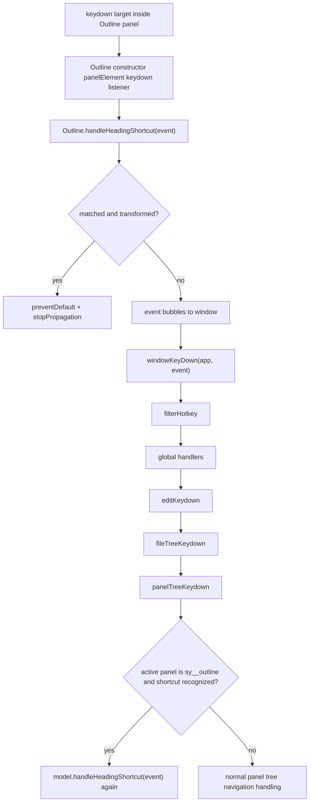

# Outline Heading Shortcut Root-Cause Investigation

Date: 2026-05-24

Scope: investigation only. No production code was changed.

## Current Observed Behavior

- Reported behavior: `Ctrl+Alt+1..6` in the editor is intended to convert the current block or selected blocks to an exact heading level.
- Reported behavior: in the Outline panel, single-selection behavior can appear to work in some click-driven cases, but `Ctrl+Alt+1..6` is not reliable.
- Reported behavior: Outline multi-selection uses `b3-list-item--focus`, not the old `b3-list-item--selected`.
- Source-level observation: the Outline shortcut path can be reached, but it only transforms headings collected from `Outline.selectedHeadingIds`. DOM focus state alone is not enough.
- Source-level observation: the global dock keydown path no longer simply filters this shortcut out. It explicitly recognizes Outline heading shortcuts and delegates them to `Outline.handleHeadingShortcut(event)`.

## Expected Behavior

- With focus in the Outline panel, `Ctrl+Alt+1..6` should convert the focused Outline heading, or all selected Outline headings, to the requested exact level.
- If multiple Outline items are visually selected with `b3-list-item--focus`, the shortcut should use that same selection source.
- The Outline shortcut matcher should accept the same configured heading shortcuts as the editor path, and should not reject the same physical shortcut after the global dock path has already classified it as an Outline heading shortcut.

## Event Flow

When the key event target is inside the Outline panel:

Ordered call chain with files:

1. `app/src/layout/dock/Outline.ts`, `Outline` constructor: `options.tab.panelElement.addEventListener("keydown", ...)` calls `this.handleHeadingShortcut(event)`.
2. `app/src/layout/dock/Outline.ts`, `Outline.handleHeadingShortcut`: tries exact heading level, upgrade, and downgrade shortcuts.
3. If the Outline handler returns `false` and did not stop propagation, `app/src/boot/globalEvent/event.ts` sends the event to `windowKeyDown(app, event)`.
4. `app/src/boot/globalEvent/keydown.ts`, `windowKeyDown`: after global shortcuts, calls `editKeydown`, then `fileTreeKeydown`, then `panelTreeKeydown`.
5. `app/src/boot/globalEvent/keydown.ts`, `panelTreeKeydown`: computes `isOutlineHeadingShortcut`; if true and the active model is `Outline`, it calls `model.handleHeadingShortcut(event)`.

## Editor Shortcut Path

The editor path is direct and config-driven:

- `app/src/protyle/wysiwyg/keydown.ts` installs a keydown listener on `editorElement`.
- For `heading1` through `heading6`, it checks `matchHotKey(window.siyuan.config.keymap.editor.heading.headingN.custom, event)`.
- On match, it calls `turnsIntoTransaction({ protyle, nodeElement, type: "Blocks2Hs", level: N })`.
- `turnsIntoTransaction` then collects `.protyle-wysiwyg--select` blocks, or falls back to the current `nodeElement`, and applies `Blocks2Hs`.

Important difference: the editor shortcut starts from a real editor block and has a built-in current-block fallback. It does not need to infer selected headings from the Outline model.

## Outline Shortcut Path

The Outline path is split between local panel handling, global dock routing, and model selection state:

- `app/src/layout/dock/Outline.ts`, constructor: the panel-level keydown listener calls `handleHeadingShortcut`.
- `app/src/boot/globalEvent/keydown.ts`, `panelTreeKeydown`: recognizes active Outline panel heading shortcuts and calls `model.handleHeadingShortcut(event)`.
- `app/src/layout/dock/Outline.ts`, `handleHeadingShortcut`: on exact level match, calls `batchSetHeadingLevel(level)`.
- `batchSetHeadingLevel` calls `getHeadingElementsForTransaction(protyle)` with no fallback element.
- `getHeadingElementsForTransaction` calls `getSelectedHeadingItems()`.
- `getSelectedHeadingItems` reads only `this.selectedHeadingIds`; it does not read `li.b3-list-item--focus` from the DOM unless the caller supplied a fallback element.
- `headingsLevelTransaction` returns immediately if `protyle` is missing, `headingElements` is empty, or no level/direction is provided.

## Exact Blockers

### 1. Selection State Is Split Between DOM Focus and `selectedHeadingIds`

Files and functions:

- `app/src/layout/dock/Outline.ts`
  - `selectedHeadingIds`
  - `replaceOutlineSelection`
  - `toggleOutlineSelection`
  - `selectOutlineRange`
  - `getSelectedHeadingItems`
  - `batchSetHeadingLevel`
  - `handleHeadingShortcut`
- `app/src/boot/globalEvent/keydown.ts`
  - `panelTreeKeydown`

Details:

- Outline click paths update `selectedHeadingIds` and then mirror it to `b3-list-item--focus`.
- Global panel keyboard navigation in `panelTreeKeydown` moves `b3-list-item--focus` directly with DOM class changes. It does not call any Outline selection method and does not update `selectedHeadingIds` or `lastSelectedElement`.
- `Outline.setCurrentById` also manipulates `b3-list-item--focus` directly without updating `selectedHeadingIds`.
- `getSelectedHeadingItems()` treats `selectedHeadingIds` as authoritative and ignores DOM-focused headings unless a fallback is explicitly passed.
- `handleHeadingShortcut` calls `batchSetHeadingLevel(level)` with no fallback element, so a visually focused Outline item can produce an empty `headingElements` list.

Impact:

- Click selection can work because the click path populated `selectedHeadingIds`.
- Keyboard focus can fail because the DOM class changed but `selectedHeadingIds` did not.
- Multi-selection can be stale or empty if the visible `b3-list-item--focus` set and the internal set diverge.

### 2. Global Routing and Outline Matching Use Different Shortcut Acceptance Rules

Files and functions:

- `app/src/boot/globalEvent/keydown.ts`, `panelTreeKeydown`
- `app/src/layout/dock/Outline.ts`, `handleHeadingShortcut`
- `app/src/protyle/util/hotKey.ts`, `matchHotKey`
- `app/src/constants.ts`, `Constants.SIYUAN_KEYMAP.editor.heading`

Details:

- `panelTreeKeydown` treats `event.ctrlKey && event.altKey && /^[1-6]$/.test(event.key)` as an Outline heading shortcut before it also checks configured keymap entries.
- `Outline.handleHeadingShortcut` checks `matchHotKey(headingConfig.headingN.custom, event)` first, and only falls back to `event.ctrlKey && event.altKey && event.key === String(level)` when no custom shortcut is configured.
- The default config has `heading1..6.custom` populated as `⌥⌘1` through `⌥⌘6`.
- Therefore, if `matchHotKey` fails for a constructed event, missing `keyCode`, keyboard-layout edge case, or browser/platform discrepancy, the Outline fallback is never used.
- `matchHotKey` relies on `Constants.KEYCODELIST[event.keyCode]`, not `event.code`. Top-row digits and numpad digits both map correctly when `keyCode` is present, but events with only `key`, `code`, or mocked shape can fail.

Impact:

- The global dock code can correctly classify the event as an Outline heading shortcut, but the Outline model can reject the same event.
- Existing tests accidentally exercise the fallback branch by omitting `headingConfig.editor.heading`, so they do not cover the production default keymap path.

### 3. The Panel Keydown Listener Ignores the Handler Return Value

File and function:

- `app/src/layout/dock/Outline.ts`, constructor keydown listener

Details:

- The listener calls `this.handleHeadingShortcut(event)` but does not inspect the return value.
- This is not the primary blocker because `handleHeadingShortcut` stops propagation internally when it succeeds.
- It does matter for diagnosis: when `handleHeadingShortcut` returns `false`, the event continues to the global handler, where `panelTreeKeydown` calls the same model method again.

Impact:

- Failed matches can run through two Outline attempts.
- This can make the shortcut appear to be intercepted globally, but the global code is usually just the second chance after the local Outline handler declined the event.

## Focus And Selection Availability

- At handler time, the focused DOM item can be available through `.b3-list-item--focus`.
- The selected-heading model state may not be available or current because only the Outline click/range/toggle methods maintain `selectedHeadingIds`.
- Multi-selected visual state is also represented by `.b3-list-item--focus`, but transaction collection uses `selectedHeadingIds`.
- `b3-list-item--selected` is not used in the current Outline code path, and tests explicitly assert it should not appear.

## Why Existing Tests Did Not Catch This

Relevant tests:

- `app/src/layout/dock/Outline.shortcuts.spec.ts`
- `app/src/layout/dock/Outline.selection.spec.ts`
- `app/src/layout/dock/Outline.transformWithSubheadings.spec.ts`
- `app/src/protyle/wysiwyg/headingShortcutTransaction.spec.ts`
- `app/src/protyle/wysiwyg/headingsLevelTransaction.spec.ts`

Gaps:

- `Outline.shortcuts.spec.ts` is source-string documentation. It checks that code contains routing strings, but it does not dispatch through the real handler and does not assert transaction behavior.
- `Outline.selection.spec.ts` dispatches `Ctrl+Alt+number`, but its mocked `window.siyuan.config.keymap.editor` lacks `heading`. That forces `Outline.handleHeadingShortcut` into the no-custom fallback branch, bypassing the production default `matchHotKey` path.
- `Outline.selection.spec.ts` click-selects headings before dispatching shortcuts. That populates `selectedHeadingIds`, so the test does not cover keyboard-navigation focus or DOM-only multi-selection.
- The existing Outline multi-selection shortcut test verifies the happy path after `clickHeading(A)` then `Ctrl-click(B)`, not the reported failing path where visual focus/selection and internal state diverge.
- `headingShortcutTransaction.spec.ts` is transaction-layer only. It starts after selected heading blocks have already been collected, so it cannot catch Outline selection collection failures.
- `headingsLevelTransaction.spec.ts` validates the helper behavior when invoked correctly, but it does not cover the Outline event path.

Test run evidence from this investigation:

- `pnpm -C app test:unit -- Outline.shortcuts`: passed, `4 passed | 5 todo`.
- `pnpm -C app test:unit -- Outline`: passed, `21 passed | 9 todo`.
- `pnpm -C app test:unit -- headingsLevelTransaction`: failed during module import before tests ran. Error: `TypeError: Class extends value undefined is not a constructor or null` at `app/src/layout/dock/Backlink.ts`.
- `pnpm -C app test:unit -- headingShortcutTransaction`: failed with the same import-time `Backlink extends Model` error.

## Minimal Implementation Plan

Do not implement in this investigation pass.

1. Extract or add a small Outline selection collector used by shortcut handling:
   - Prefer `selectedHeadingIds` when it is non-empty and maps to live Outline headings.
   - Otherwise fall back to live DOM `li.b3-list-item--focus[data-type="NodeHeading"][data-node-id]`.
   - Keep `lastSelectedElement` and `sy__outline--multi-select` consistent only if the implementation intentionally synchronizes state.
2. In `handleHeadingShortcut`, pass the currently focused Outline item or use the shared collector before calling `batchSetHeadingLevel`.
3. Make Outline shortcut matching use the same effective acceptance as `panelTreeKeydown`:
   - First honor configured `matchHotKey`.
   - Also accept the explicit `Ctrl+Alt+1..6` fallback for the default exact-heading family when the event shape clearly matches.
   - Keep upgrade/downgrade handling similarly aligned for `Alt++`, `Alt+=`, and `Alt+-`.
4. Avoid changing `headingsLevelTransaction` unless new tests show helper-level behavior is wrong. Current evidence points to event routing and selection collection, not the transaction helper.

## Minimal TDD Plan

Add or change tests before implementation:

1. Add an Outline shortcut test with production-shaped heading keymap:
   - Configure `heading1.custom = "⌥⌘1"`.
   - Dispatch `KeyboardEvent("keydown", { ctrlKey: true, altKey: true, key: "1", bubbles: true })` without `keyCode`.
   - Assert the Outline shortcut path still resolves level `1`.
2. Add a DOM-focus fallback test:
   - Do not call `clickHeading`.
   - Add `b3-list-item--focus` to one Outline heading.
   - Dispatch `Ctrl+Alt+2`.
   - Assert `headingsLevelTransaction` receives that heading and `level: 2`.
3. Add a DOM multi-focus fallback test:
   - Do not populate `selectedHeadingIds` directly.
   - Add `b3-list-item--focus` to two Outline headings.
   - Dispatch `Ctrl+Alt+6`.
   - Assert both headings are collected.
4. Add a global routing integration test around `panelTreeKeydown` or an extracted pure predicate:
   - Verify the event classified by `isOutlineHeadingShortcut` is accepted by the Outline model matcher.
5. Keep existing click-driven tests:
   - They validate the already-working `selectedHeadingIds` path and protect against breaking context-menu selection behavior.
6. Repair the import-time failures in `headingShortcutTransaction.spec.ts` and `headingsLevelTransaction.spec.ts` test setup, or isolate those specs from modules that import `Backlink`.

## Minimal Root Cause

The smallest root cause is not a single missing transaction call. It is a mismatch between the state and matching layers:

1. Outline shortcut transactions collect headings from `selectedHeadingIds`, while real Outline keyboard focus and multi-selection are represented in the DOM with `b3-list-item--focus`.
2. The global dock handler can route `Ctrl+Alt+1..6` as an Outline heading shortcut using `event.key`, but the Outline model can reject the same event because its fallback is disabled whenever a custom keymap entry exists.

Those two mismatches explain why click-selected single headings can appear to work, while keyboard-focused and multi-selected Outline headings remain unreliable.
